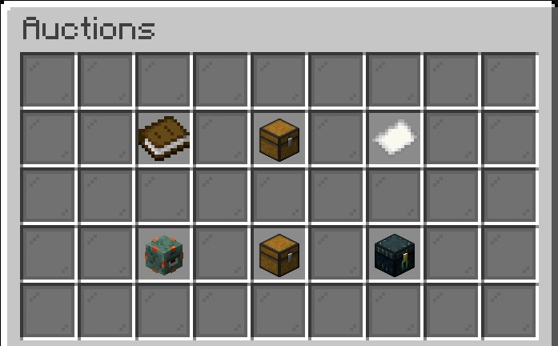

# Auction House

## What is the Auction House?

The Auction House GUI allows players to buy items from or sell items to other players.

## GUI Overview

You can open the Auction House GUI by right-clicking the NPC at `/warp auction` or by using the `/ah` command.

### All Auctions

By clicking on the book, you can view an overview of all active auctions.

By hovering over each item, you can see information such as the enchantments, seller, starting price, current price, bid increment, who has the highest bid, and how long you have until the auction expires.

By clicking on the item, you can open the bid GUI.

### Categories

By clicking on the first chest, you can open the "All Categories" menu.&#x20;

There are 12 main categories and one "Other" to catch the items that don't fit into a specific category.

* Food
* Building Block
* Decoration Blocks
* Redstone
* Transportation
* Miscellaneous
* Tools
* Combat
* Brewing
* Materials
* Dyes
* Spawn Eggs

### Auctions You've Placed a Bid on

### Your Auctions

### Won Items

### Expired Items

