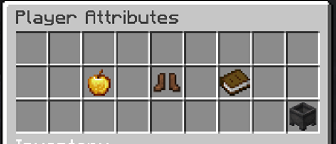

# Skills & Attributes

## Skills

Each class has a different set of skills, which can be unlocked by leveling up. Every time you level up your class, you will get one skill point. You can use it to level up an existing skill. This will increase the amount of damage, healing, etc., but will also require more mana/rage.

To assign skills, open the `/skills` menu and click the pink glass to switch to “binding.” From here, you can select the skill you want to use, and click on the skill slot you want to use.

To activate skills, hold `Shift`, and press `F` to bring up the skill casting menu. You can then press the number key shown in your action bar to use a skill.

## Professions

There are eight professions: **Mining, Woodcutting, Farming, Fishing, Alchemy, Smithing, Enchanting, and Smelting**.

By performing regular actions (cutting down trees, mining ores, etc.) you will level up your professions. When you level up in one of your professions, you will receive an attribute point to use in `/attributes`.

## Attributes

There are three attributes; Strength, Dexterity, and Intelligence. Each can be leveled up in `/attributes` using attribute points (gained from leveling up professions).

**Strength** increases your weapon damage and max health.

**Dexterity** increases your physical damage, projectile damage, and attack speed.

**Intelligence** increases your magic damage, cooldown reduction, and max mana.

Attribute points are gained when leveling up a skill 5 times or class every level and can be used with `/attributes` to increase your Strength, Dexterity, or Intellect.

## Your Character

.png>)

The commands `/player` or /`p` will open your character menu. From this menu, you get an overview of your skill progression as well as allocated attribute points and class level.
