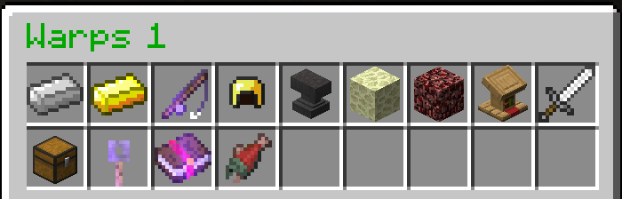
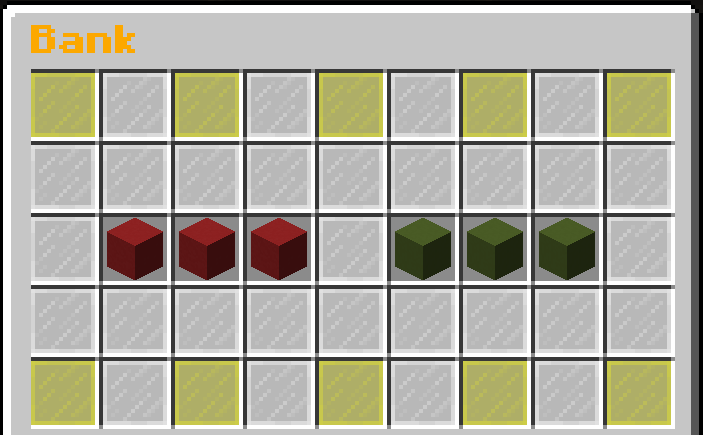
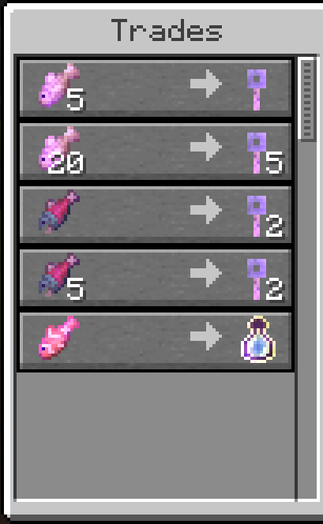

# Warps

## What are Warps?

Warps are set locations players can teleport to, similar to `/spawn`.

## GUI Overview

The `/warps` GUI is automatically generated, so it may change over time.

### Auction

The NPC at `/warp Auction` opens the `/ah` GUI. See [Auction House](auction-house.md) for more information.

### Artifacts

The villagers at `/warp Artifacts` allow you to trade artifacts for custom armor, weapons, and tools. You can use the **Artifact Conversion** NPC to upgrade your artifacts.

### Bank

The NPC at `/warp bank` opens the Bank GUI. This is **unlocked at rank 3** and allows you to deposit or withdraw money easily.

You can deposit or withdraw money in increments of 100, 1000, or your entire available balance.

### Blacksmith

The NPC at `/warp Blacksmith` opens the Mythical Forge.

Using the Mythical Forge, you can craft items with special abilities!

### Crates

The crates at `/warp Crates` are filled with random loot! You can win anything from money to diamonds, spawners, and more!

### Crate Upgrades

The NPC at `/warp CrateUpgrades` opens the Crate Key Conversion GUI. You can use this to trade your lower-tier keys all the way up to Ethereal.

### Enchants

.png>)

The NPC at `/warp Enchants` normally opens the Custom Enchantments GUI but has been temporarily disabled due to plugin issues.

### Fishing

When fishing in the spawn realm, there is custom loot. You can find anything from cobblestone to legendary fish (which you can trade for crate keys at `/warp FishingShop`).

### Fishing Shop

The Fishing Shop allows you to trade your fishing rewards for crate keys and consumables.

### Hall of Heroes

The Hall of Heroes warp has various NPCs and leaderboards to showcase players' achievements on the server.

### Repair

Right-Clicking the anvil at `/warp Repair` opens the Repair GUI. You can use this to repair the item you are currently holding for $5000.
